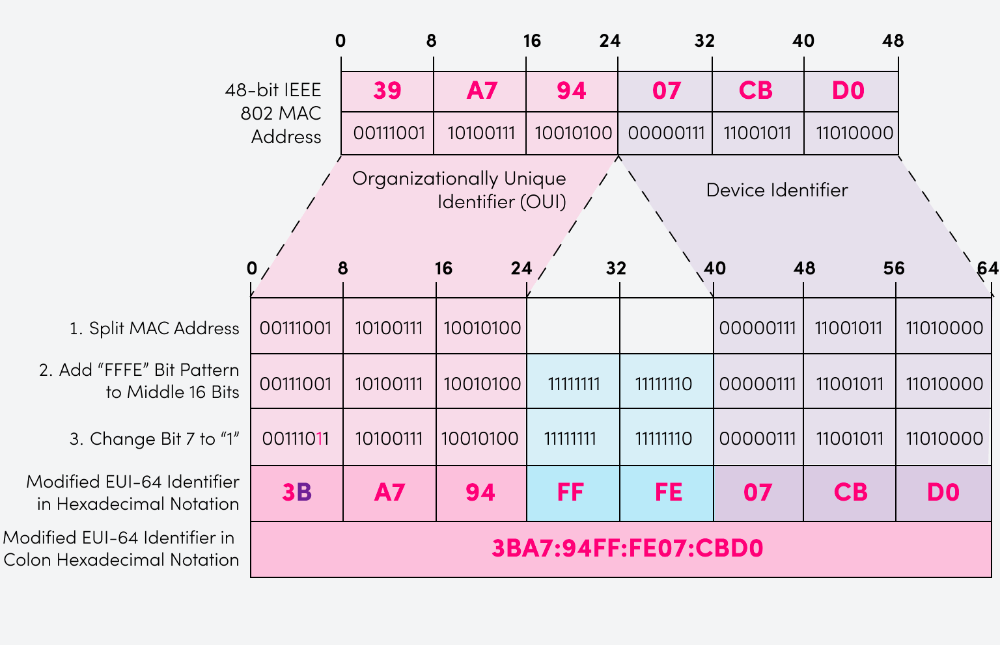
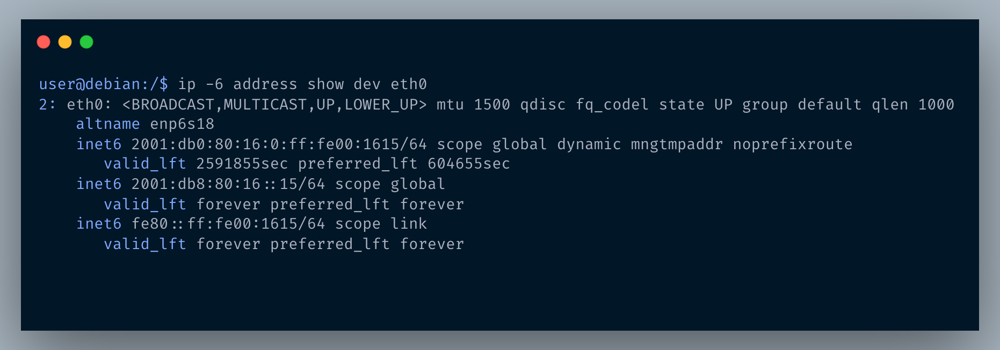
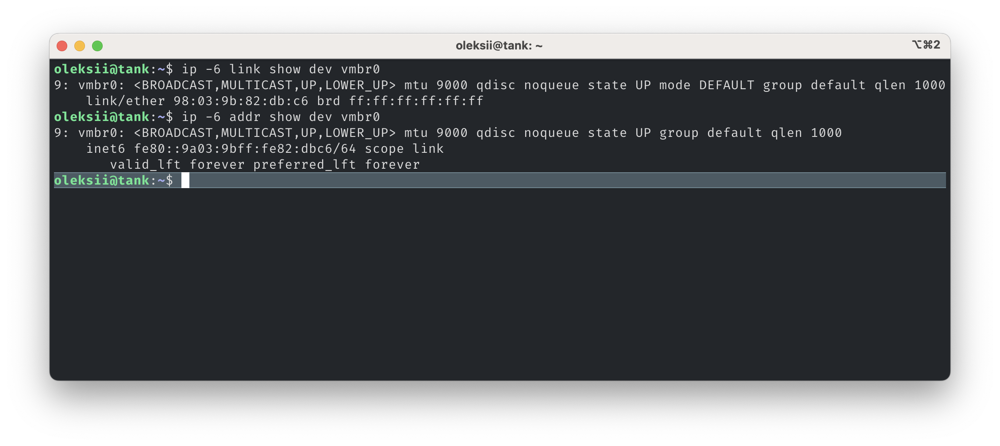

EUI-64 IPv6 address in Terraform
===

## What is EUI-64?
**Extended Unique Identifier (EUI)**, as per [RFC4291](https://datatracker.ietf.org/doc/html/rfc4291), allows a host to assign iteslf a unique 64-bit IPv6 address derived from EUI-64 and given IPv6 prefix. This feature is a key benefit over IPv4 as it eliminates the need of manual configuration or DHCP as in the world of IPv4.

The IPv6 EUI-64 format address is obtained through the 48-bit MAC address as explained in below diagram and combining the result with given IPv6 subnet prefix

<p align="center">

</p>

`FFFE` is a reserved value, chosed by IEEE which can only appear in EUI-64 generated from the an EUI-48 MAC address.

## How to use

### Using as a module

Can be used as a module as per below example

```terraform

module "eui64" {
  for_each    = var.instances
  source      = "git::https://github.com/noroutine/terraform-eui64.git"
  mac_address = proxmox_virtual_environment_vm.vm[each.key].mac_addresses[0]
  ipv6_prefix = "2001:db8:1:2::/64"
}

resource "local_file" "inventory" {
  for_each = var.instances
  filename = "${path.root}/terraform_inventory/${each.key}.yaml"
  content = templatefile("${path.module}/inventory.tpl", {
    name                           = each.value["name"],
    macaddress                     = lower(proxmox_virtual_environment_vm.vm[each.key].mac_addresses[0]),
    eui64                          = module.eui64[each.key].eui64,
    ipv6_eui64_address             = module.eui64[each.key].ipv6_eui64_address_shortened,
  })
}


resource "proxmox_virtual_environment_vm" "vm" {
  for_each  = var.instances
  # ...
}

variable "instances" {
  type    = map(any)
  default = {}
}

```

### Using as is
```
git clone https://github.com/noroutine/terraform-eui64.git eui64

cd eui64
terraform init
terraform apply -auto-approve \
  -var "mac_address=02:00:00:00:16:15" -var "ipv6_prefix=fe80::/10"
```

Example output
```
No changes. Your infrastructure matches the configuration.

Terraform has compared your real infrastructure against your configuration and found no differences, so no
changes are needed.

Apply complete! Resources: 0 added, 0 changed, 0 destroyed.

Outputs:

eui64 = "000000fffe001615"
ipv6_eui64_address = "fe80::ff:fe00:1615"
```

This should potentially match the link-local IPv6 address on the node with given MAC address

<p align="center">

</p>

### Example with real MAC

Mellanox ConnectX-4 Lx MAC 

```
terraform apply -auto-approve \
  -var "mac_address=98:03:9b:82:db:c6" -var "ipv6_prefix=fe80::/10"
# ...
eui64 = "9a039bfffe82dbc6"
ipv6_eui64_address = "fe80::9a03:9bff:fe82:dbc6"
```

<p align="center">

</p>

## References
* [RFC4291 IP Version 6 Addressing Architecture](https://datatracker.ietf.org/doc/html/rfc4291) Appendix A

## Credits
* [Summary of EUI-64 key concepts](https://www.catchpoint.com/benefits-of-ipv6/eui-64) by Catchpoint
* [`assert` provider](https://github.com/hashicorp/terraform-provider-assert) by [@bschaatsbergen](https://github.com/bschaatsbergen)